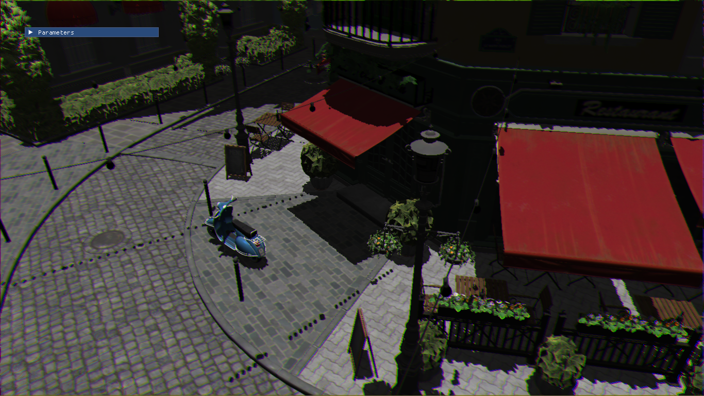

# Build and run
The build process uses cmake and is an adaptation of [LearnOpenGL](https://github.com/JoeyDeVries/LearnOpenGL) work. 
## Windows build

As all the required libs and headers are already in the project, just run cmake and open the generated solution (Cmake gui for windows was used in my case). Cmake may require admin privileges.

## Linux build
First make sure you have CMake, Git, and GCC by typing as root (sudo) `apt-get install g++ cmake git` and then get the required packages: Using root (sudo) and type `apt-get install libsoil-dev libglm-dev libassimp-dev libglew-dev libglfw3-dev libxinerama-dev libxcursor-dev  libxi-dev libfreetype-dev libgl1-mesa-dev xorg-dev` .

Build through CMake-gui: The source directory is SproutEngine and specify the build directory as SproutEngine/build. Creating the build directory within SproutEngine is important for linking to the resource files (it also will be ignored by Git). Hit configure and specify your compiler files (Unix Makefiles are recommended), resolve any missing directories or libraries, and then hit generate. Navigate to the build directory (`cd SproutEngine/build`) and type make in the terminal. This should generate the executables in the respective chapter folders.

Build through Cmake command line:

```
cd /path/to/SproutEngine
mkdir build && cd build
cmake ..
cmake --build .
```

Mac OS X building

## MacOS build
Building on Mac OS X is fairly simple:

```
brew install cmake assimp glm glfw freetype
cmake -S . -B build
cmake --build build -j$(sysctl -n hw.logicalcpu)
```

# Features
The project is divided into different targets, each focusing on an aspect of realtime rendering.
## Rasterization
Realtime rasterization rendering. As of now, is implemented:
- model loading and displaying, through the graphics pipeline
- Blinn lighting model
- Chromatic aberrations through framebuffers

In progress:
- Frustum culling
- Shadow mapping



## Raytracing
Raytracing on both CPU and GPU. Implemented on the GPU side:
- Direct illumination and shadows on spheres
- Movement though the scene (No way, realtime???)
- Diffuse lighting with materials, emissive triangles and frame accumulation


On the CPU side:
- Light bounces, with different material types (lambertians, dielectrics, mettalic)
- Antialiasing 
- BVH that can be displayed by rasterization for debugging purposes


## Physics
Integration of a physics engine to the rendering. Implemented:
- Rigidbody physics, without collisions as of now
- Basic physics solver, running on a parallel thread. Can be paused, resumed. 
- Spring joints (in progress)